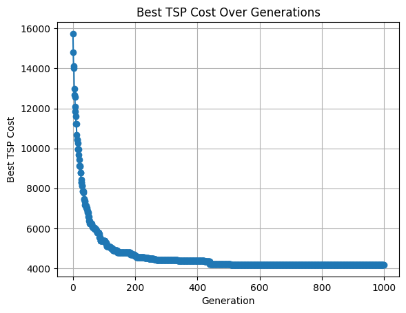

# Computational Intelligence - Lab 2
## Traveling Salesman Problem

### Introduction
The Traveling Salesman Problem (TSP) is the challenge of finding the shortest path or shortest possible route for a salesperson to take, given a starting point, a number of cities (nodes), and optionally an ending point.

The TSP is known to be a combinatorial optimization problem that’s an NP-hard problem, which means that the number of possible solution sequences grows exponentially with the number of cities. 

Computer scientists have not found any algorithm for solving traveling salesman problems in polynomial time, and therefore rely on approximation algorithms to try numerous permutations and select the shortest route with the minimum cost.

### Work done

A matrix stores the geographical distances using the latitudes and longitudes of the respective cities. The cities under study are located in the `cities` directory in CSV files. Each row is represented by the tuple: `"city_name", latitude, longitude`. For this lab, we chose the first city in the CSV file as the starting and ending point of the circular route, which is where the list of study cities is defined.

I do not know which approach is the fastest and most approximate or which is the slowest and most accurate. Therefore, I started to define an algorithm in the file `lab2-fast.ipynb`, which we can consider as the `first approach`; then I defined further aspects that made up the algorithm found in the file `lab2-slow.ipynb`, which we can consider as the `second approach`.

(<i>For the construction of the visual plots I relied on the web, for the matplotlib library</i>)

#### First approach

A population of `N` individuals is defined. An individual represents a possible sequence of cities. Each individual always starts and ends with the first city (circular route). These two "genes" can never be modified by the algorithms applied.

The `genetic algorithm` works as follows:
1. A population of N individuals and a set number of generations are defined.
2. For each generation, the following steps are performed:
   1. For each individual, its cost is calculated.
   2. Parent selection occurs, sampled from 1/5 of the population (`tournament selection`).
   3. The best 10 individuals, or a maximum of 10, are selected.
3. Until a number of offspring equivalent to half of the population is generated, the following steps are performed:
   1. Two parents are chosen from the set returned by the tournament selection.
   2. A cycle crossover operation occurs between the parents, inheriting the consecutiveness of some cities.
   3. A mutation algorithm is applied to the genes only if below a certain probability, which is not adaptive (mutation_rate).
   4. The newly generated child is added to the offspring.
4. The offspring is added to the current population.
5. A steady state approach is adopted, where only the fittest from the combined population survive; the others die.
6. Return to step 2.

<table>
    <tr>
        <th colspan="4">Italy</th>
    </tr>
    <tr>
        <td>Generations: 1000</td>
        <td>Population: 150</td>
        <td>Total Cost: 4459 (km)</td>
        <td>Total Steps: 1000 (generations) within 150 individuals each</td>
    </tr>
    <tr>
        <td colspan="2"></td>
        <td colspan="2"></td>
    </tr>
</table>

<table>
    <tr>
        <th colspan="4">China</th>
    </tr>
    <tr>
        <td>Generations: 1000</td>
        <td>Population: 300</td>
        <td>Total Cost: 317264 (km)</td>
        <td>Total Steps: 1000 (generations) within 300 individuals each</td>
    </tr>
    <tr>
        <td colspan="2"></td>
        <td colspan="2"></td>
    </tr>
</table>

<table>
    <tr>
        <th colspan="4">Russia</th>
    </tr>
    <tr>
        <td>Generations: 1000</td>
        <td>Population: 200</td>
        <td>Total Cost: 46827 (km)</td>
        <td>Total Steps: 1000 (generations) within 200 individuals each</td>
    </tr>
    <tr>
        <td colspan="2"></td>
        <td colspan="2"></td>
    </tr>
</table>

<table>
    <tr>
        <th colspan="4">US</th>
    </tr>
    <tr>
        <td>Generations: 1000</td>
        <td>Population: 300</td>
        <td>Total Cost: 103613 (km)</td>
        <td>Total Steps: 1000 (generations) within 300 individuals each</td>
    </tr>
    <tr>
        <td colspan="2"></td>
        <td colspan="2"></td>
    </tr>
</table>

<table>
    <tr>
        <th colspan="4">vanuatu</th>
    </tr>
    <tr>
        <td>Generations: 50</td>
        <td>Population: 10</td>
        <td>Total Cost: 1345 (km)</td>
        <td>Total Steps: 50 (generations) within 10 individuals each</td>
    </tr>
    <tr>
        <td colspan="2"></td>
        <td colspan="2"></td>
    </tr>
</table>

#### Second approach

The model of the algorithm remains similar to the previous one, with some differences and the number of offsprings generated during each generation is augmented.

`Generational model applied` + `Elitist strategy`:
The offspring corresponds to 150% of the population. The best 10% of individuals in the population pass to the next generation, while the rest are discarded (Elitist strategy). The top 60% of the offspring survive after competing for survival. The two sets are then combined to obtain the next generation.

Inver crossover has been added to the genetic algorithm.

A simulated annealing process has been implemented, with a self-adaptive approach to the cooling rate. A self-adaptive cooling rate dynamically adjusts the cooling rate based on the improvements observed in the solutions. This allows the algorithm to adapt more quickly if it detects stagnation (e.g., few improvements over several generations), while slowing down if it continues to find better solutions. This can prevent the temperature from cooling too fast, which might hinder further exploration. The mutation rate has been removed.

<table>
    <tr>
        <th colspan="4">Italy</th>
    </tr>
    <tr>
        <td>Generations: 1000</td>
        <td>Population: 150</td>
        <td>Total Cost: 4175 (km)</td>
        <td>Total Steps: 1000 (generations) within 150 individuals each</td>
    </tr>
    <tr>
        <td colspan="4">Respect to first approach: -6.37%</td>
    </tr>
    <tr>
        <td colspan="2"></td>
        <td colspan="2"></td>
    </tr>
</table>

<table>
    <tr>
        <th colspan="4">China</th>
    </tr>
    <tr>
        <td>Generations: 1000</td>
        <td>Population: 300</td>
        <td>Total Cost: 285340 (km)</td>
        <td>Total Steps: 1000 (generations) within 300 individuals each</td>
    </tr>
    <tr>
        <td colspan="4">Respect to first approach: -10.06% (but far slower)</td>
    </tr>
    <tr>
        <td colspan="2"></td>
        <td colspan="2"></td>
    </tr>
</table>

<table>
    <tr>
        <th colspan="4">Russia</th>
    </tr>
    <tr>
        <td>Generations: 1000</td>
        <td>Population: 200</td>
        <td>Total Cost: 49103 (km)</td>
        <td>Total Steps: 1000 (generations) within 200 individuals each</td>
    </tr>
    <tr>
        <td colspan="4">Respect to first approach: +4.86% (worse solution here!)</td>
    </tr>
    <tr>
        <td colspan="2"></td>
        <td colspan="2"></td>
    </tr>
</table>

<table>
    <tr>
        <th colspan="4">US</th>
    </tr>
    <tr>
        <td>Generations: 1000</td>
        <td>Population: 300</td>
        <td>Total Cost: 92396 (km)</td>
        <td>Total Steps: 1000 (generations) within 300 individuals each</td>
    </tr>
        <tr>
        <td colspan="4">Respect to first approach: -10.82% (but far slower)</td>
    </tr>
    <tr>
        <td colspan="2"></td>
        <td colspan="2"></td>
    </tr>
</table>

<table>
    <tr>
        <th colspan="4">vanuatu</th>
    </tr>
    <tr>
        <td>Generations: 50</td>
        <td>Population: 10</td>
        <td>Total Cost: 1345 (km)</td>
        <td>Total Steps: 50 (generations) within 10 individuals each</td>
    </tr>
        <tr>
        <td colspan="4">Respect to first approach: no changes</td>
    </tr>
    <tr>
        <td colspan="2"></td>
        <td colspan="2"></td>
    </tr>
</table>

### Considerations

What I noticed, doing some experiments, is that as the generations increase, the possibility of obtaining an approximate global optimum increases, but this entails a significant increase in the search time. If the problem is large enough, the algorithm does not scale. If we try to increase the number of traits available, and therefore in this case the number of permutations, and therefore the number of individuals, this entails a significant increase in processing time.
